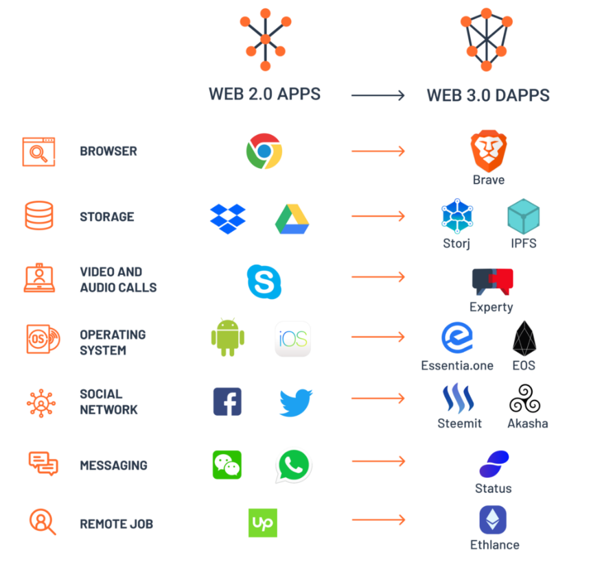

## Why the Web 3.0 Matters and you should know about it | 为什么 Web 3.0 很重要并且你应该了解它

> 本文翻译自：https://medium.com/@matteozago/why-the-web-3-0-matters-and-you-should-know-about-it-a5851d63c949
> 
> 译者：[区块链中文字幕组](https://github.com/BlockchainTranslator/EOS) [平兄](https://bihu.com/people/281720)
> 
> 翻译时间：2018-04-24

### Humble beginnings | 简陋的起点 1.0 
-------
There’s plenty of buzz around the web 3.0 and the sweeping changes it will bring to the industry, but few people actually know why it spawned and what it will bring. To understand this, it’s necessary to travel back in time and examine it predecessors, Web 1.0 & 2.0.

关于 Web 3.0 ，市场议论纷纷。有些人认为它将会给这个行业带来巨大的改变，但实际上只有少数人知道它为什么会诞生以及它将带来什么。要想明白这些点，我们需要将目光回溯到以前，研究下他的前生，Web 1.0 & 2.0 。

Just like the Middle Ages, the Web 1.0 wasn’t given its name until it bit the dust. The ‘World Wide Web’ as it was known, was just a set of static websites with a load of information and no interactive content. Connecting meant dialing up through rickety modems and blocking anyone in the house from using the phone. It was the web of AOL chat rooms and MSN messenger, of AltaVista and Ask Jeeves. It was maddeningly slow. Streaming videos and music? Forget it. Downloading a song would take at least a day.

中世纪时期，Web 1.0 在被得到普遍应用前都尚未有自己的名字。众所周知的 'World Wide Web' 万维网，那时候只是一系列装载着信息的静态网页，也没有交互的动态内容。连接就意味着通过脆弱的调制解调器拨号，而且会阻断了在家里使用着电话的任何人。那时候的美国在线（AOL chat rooms） 、MSN Messenger（微软即时通讯软件）、Ask Jeeves（美国一种搜索引擎）以及 AltaVista（搜索引擎）都是使用这种网络。网速极慢，观看下载视频音乐是想都不用想的，下载一首歌可能至少要一天。

### And then there was 2.0 | Web 2.0 时代来了
-----------
The memory of bleepy modems and boring interfaces has largely floated away. Faster internet speeds paved the way for interactive content, the web wasn’t about observing anymore, it was about participating. The global sharing of information spawned the age of ‘Social Media’. Youtube, Wikipedia, Flickr and Facebook gave voices to the voiceless and a means for like-minded communities to thrive.

这个时候，调制解调器和单一的网页已经大规模地淡出人们的视野。相对更快的网速促进了交互性动态网页的实现，网页不再是单纯地浏览，更多能进行交互。全球信息共享催生了 ‘ 社交媒体 ’ 时代。Youtube , Wikipedia , Flickr 以及 Facebook 给那些没有发言权的人发声的机会，并为志同道合的社区发展提供了蓬勃发展的途径。

Publishing this blog post will take me a hassle-free 30 seconds, an immeasurable improvement from when it took a concerted effort between designers, developers and administrators just to make a simple website edit. We could call this the Read-Write-Publish’ era — where the spread of information is as simple as those three words. So it begs the question, the web 2.0 is great, what went wrong?

发布这篇博客可能只需要花费 30 秒，毫不费劲。当设计师、开发人员和管理人员齐心协力地做一个简单的编辑网站时，这是一个不可估量的进步。我们可能称这是‘读-写-发布’的时代，信息的传播极其简单。那么问题来了，Web 2.0 时代如此美好，究竟哪里出问题了？

#### Information is money | 信息就是金钱
---------
The UN estimated internet users increased from 738 million to 3.2 billion from 2000–2015. That’s an unfathomable amount of data floating around, and as big digital corporations realized, personal information is an enormously valuable asset. So began the mass stockpiling of data in centralized servers, with Amazon, Facebook and Twitter the biggest custodians. People sacrificed security for the convenience of these services; whether they knew it or not, their identities, browsing habits, searches and online shopping information was sold to the highest bidder.

联合国预计，从 2000 年 ~ 2015 年，互联网用户数量大约从 7.38 亿增长到 32 亿。随着巨量级的数据产生，慢慢地大型数字公司意识到，个人信息是一种巨大的有价值财产。因此开始大量收集数据到中心服务器，Amazon , Facebook 以及 Twitter 是最大的数据托管方。用户享受互联网服务的便利性时也牺牲了信息的安全性。他们可能不知道，他们的身份信息，浏览习惯，搜索和在线购物信息都被卖给了竞价最高的出价人。

### The 3.0 revolution | 3.0 革命
---------
By this stage, Web 2.0 exponents were already dreaming up a successor. The next web, they envisaged, would take nostalgic turn to the vision of the web 1.0: more ‘human’ and more privacy. Rather than concentrating the power (and data) in the hands of huge behemoths with questionable motives, it would be returned the rightful owners.

在这个阶段，Web 2.0 布道者已经在想象着一个继承者。他们设想中的下一代网络，反倒会复原 Web 1.0 版本的一些特性：更加 ‘ 人权 ’ 和尊重隐私。而不是权利和数据都集中在动机可疑的巨头们的手里，它们将回归到合法所有者自己手上。

The vision of a fairer and more transparent web dates back to around 2006, but the tools and technologies weren’t available for it to materialize. Bitcoin was still three years off, bringing with it the notion of a distributed ledger, or blockchain, for peer-to-peer digital storage. Decentralization was the idea; blockchain was the means. Now we have what is described as human-centered internet.

构建一种更公平更透明的网络的愿景可以追溯到大约 2006 年，但以当时的科技以及工具无法实现。三年后，比特币才以分布式账本，区块链，点对点电子存储等概念出现在人们眼前。去中心化是理念；区块链是手段。现在我们已经拥有了所谓以人为中心的网络了。

### The pro-privacy, anti-monopoly web | 高隐私，反垄断的网络
--
While the Web 2.0 democratized many power structures and created new opportunities, the economic engine is largely privatized and monopolized. Facebook, Uber and AirBnB have created private networks for public infrastructure which they dominate. The Web 3.0 is the antithesis of this, it’s about multiple profit centers sharing value across an open network.

虽然 Web 2.0 民主化了许多权利机构并且产生了许多新的机会，但当前的经济模式也因此更加私有化与垄断化。Facebook , Uber 和 AirBnB 已经建立了他们主导的为基础设施服务的私有网络。Web 3.0 则是与之相反的，它是一个由多个可获利节点组成的共享价值的开放型网络。

It’s easy to envision a not-too-distant future where crypto-based phones, VPN’s, decentralized storage and cryptocurrency wallets are widespread. A future without the need of network and cellular providers that suspend or surveil our information. If we’re to avoid sleep-walking into a Black Mirror style privacy dystopia, these are the tools we require. There are a number of advantages that Web 3.0 offers:

我们不难想象一个不太遥远的未来，那时候加密手机，VPN，分布式存储以及加密钱包已经普遍使用。一个不需要那些拦截或者监控我们信息的网络和移动电话运营商的未来。如果我们不想不小心进入 Web 2.0 的黑暗面世界，我们就需要下面这些工具。这是一些 Web 3.0 的优势：

No central point of control: Middlemen are removed from the equation, blockchains like Ethereum provide a trust-less platform where the rules are unbreakable and data is fully encrypted. Alphabet and Apple will no longer have control of user data. No government or entity will have the ability to kill sites and services; and no single individual can control the identities of others.

**无控制中心**：在 3.0 范式中移除了中间人这一模式，像以太坊这种区块链应用提供了一种 ‘ 无信用 ' 平台，在这个平台上面规则不可破，数据都经过加密，用户无需担忧对方信用问题。Alphabet 和 苹果对用户的数据不再有控制权。没有任何政府或者实体机构有能力扼杀网站和服务；没有一个人能控制别人的身份。

Ownership of data: End users will regain complete control of data and have the security of encryption. Information can then be shared on a case-by-case and permissioned basis. At present, big companies like Amazon and Facebook have factories of servers storing information on dietary preferences, income, interests, credit card details and more. It’s not merely to improve their services — marketers and advertisers pay billions each year for the data.

**数据所有权**：终端用户将能重新获得对数据的完全控制权以及加密安全性。信息可以在具体情景在允许的情况下进行共享。目前，像亚马逊和脸书这样的巨头就拥有规模级的服务器，存储着用户的餐饮习惯、收入、兴趣、信用卡详情等信息。而这一切不仅仅是为了改善他们的服务，其实营销商和广告商每年为购买使用这些数据都得支付数十亿美元。

Dramatic reduction in hacks and data breaches: Because data will be decentralized and distributed, hackers would need to turn off the entire network, while state-sponsored tools such as Vault7, used by the three-letter agencies, would be rendered obsolete. At present, internet companies are compelled to hand over user data or succumb to having the entire database scrutinized. These data intrusions aren’t just limited to major security threats such as terrorism; in 2017, Coinbase took the IRS to court over its demand to see the data of over 15,000 customers.

 **大幅减少黑客攻击和数据损坏**：由于数据将会是分布式存储，所以黑客需要攻击整个网络（或者一半以上）。目前，许多互联网公司已经被强迫移交用户数据或者屈服接受整个数据库的审查。这种数据侵犯的目的不仅仅局限于恐怖行动等重大安全威胁；在 2017 年，Coinbase 就美国国税局要求允许他们查看超过 15，000 个用户的数据这事把他们告上了法庭。
 
The case, which Coinbase eventually lost, paved the way for government entities to pick over the finances of thousands of customers, with little due cause to justify the intrusion. Cases like this are unfortunately not isolated; in 2013 secure email provider Lavabit chose to shut down rather than hand its SSL keys over to the US government so it could surveil Edward Snowden.

Coinbase 最终还是输掉了官司，导致了政府机构有机会调查成千上万的用户的财务状况，却无需任何辩护理由。不幸地是，这不是唯一一件这种类型的案子；在 2013 年，安全电子邮件提供商 Lavabit 宁可关闭服务也不愿意将其 SSL 密钥交给美国政府，因为那样政府就可以监控斯诺登了。

Interoperability: Applications will be easy to customize and device-agnostic, capable of running on smartphones, TVs, automobiles, microwaves and smart sensors. At present, applications are OS-specific, and are often limited to a single operating system. For instance, many Android cryptocurrency wallets are unavailable on iOs, causing frustration for consumers who use multiple devices. It adds expenses for developers tasked with issuing multiple iterations and updates of their software.

**互操作性**：应用程序将可以轻松进行自定义并且与设备无关，它可以运行在智能手机，电视，汽车，微波炉以及只能传感器上。目前，应用程序都是运行在特定操作系统上并且通常都是被限定为单一的操作系统上。例如，许多安卓的加密钱包无法在苹果系统上使用，对使用多种设备的用户造成一定的困扰，也增加了开发者的支出，需要解决多版本的软件迭代和更新。

Permissionless blockchains: Anyone can create an address and interact with the network. The power to access permissionless chains cannot be overstated. Users will not be barred on account of geography, income, gender, orientation or a host of other sociological and demographic factors. Wealth and other digital assets can be transferred cross-border, quickly and efficiently, anywhere in the world.

**无需许可区块链**：任何人都可以创建一个地址并且与网络交互。进入这些无需许可的区块链的作用不会被夸大。用户也将不会因为地理位置，收入，性别，取向或者其他社会或者人口因素而被禁止。财富以及其他数字资产可以快速有效地进行跨国转移到世界的任何地方。

Uninterrupted service: Account suspension and distributed denial of service are dramatically reduced. Because there’s no single point of failure, service disruption will be minimal. Data will be stored on distributed nodes to ensure redundancy and multiple backups will prevent server failure or seizure.

**不间断的服务**：账户冻结和拒绝服务将显著减少。因为服务不存在单点故障，服务中断将会降到最小限度。数据将会存储在分布式节点确保信息冗余和多个备份以防止服务故障或突然宕机。

###How will it work ? | 它将如何运行？
-----
Like any emerging technology is still being refined. For access to the decentralized web, people will only need a seed. This will be a single asset which enables the interaction with dApps and other services. Individuals will still use a web browser to access the internet, and visually it will be Web 2.0 user-friendly.

像任何新型技术一样，它仍在继续完善。为了访问分布式网络，人们将只需要知道的 Web 种子路由。可以让 Dapp 和其他服务进行交互，这将会是一项财产。个人也依然可以通过浏览器访问网络，事实上界面就跟 Web 2.0 一样。

On the surface, the learning curve from 2.0 to 3.0 will be gentle. But behind the scenes, the framework connecting users with digital services are markedly different. Transactions are signed and verified manually, to prevent platforms from siphoning away personal information without due cause. Web users will opt in rather than trying — and often failing — to opt out.

从表面上看，从 2.0 到 3.0 的学习曲线很温和。 但在幕后，框架与用户的数字连接服务有着显著地不同。交易是手动签名和确认的，以防止平台在没有正当理由下窃取个人信息。互联网用户将会是选择参与到 Web 3.0 而不是尝试，退出 Web 3.0 就是不可能的了。

- Instead of Google Drive or Dropbox, we have services like Storj, Siacoin, Filecoin or IPFS technology to distribute and store files.

- 我们有类似 Storj , Siacoin , Filecoin , 或者 IPFS 技术来分发和存储文件，不再是 Google Drive 或者 Dropbox 了。

- Instead of Skype we have platforms like Experty.io.

- 我们有 Experty.io 这样的平台，而不是 Skype。

- Instead of WhatsApp and Wechat we have Status

- 我们有 Status ,而不是使用 WhatsApp 和 Wechat 。

- Instead of operating systems such as iOS and Android, frameworks such as Essentia.one and EOS provide a gateway to the new web.

- Essentia.one 和 EOS 这样的框架可以提供通往新一代网络的网关，而不是像安卓苹果这样的操作系统。

- Akasha or Steemit will play the role of Facebook, the Brave browser will serve as Chrome and Ethlance can take over from Upwork.

- Akasha 或者 Steemit 将会扮演 Facebook 的角色，Brave 浏览器将如 Chrome 一样提供服务，Ethlance 可以替代 Upwork 。

These are just a few examples. As the Web 3.0 rears into action, new platforms will emerge with a healthy level of competition not throttled by monopolistic service providers. It’s likely the best dApps and decentralized services we will use three years from now are no more than a glimmer in a developers eye.

这只是一些例子。当 Web 3.0 正式启动时，新的平台将以健康的竞争水平出现，不让垄断巨头所扼杀。三年后，它可能会是我们使用的最好的 Dapp 和去中心化服务，而不只单单是开发者的一个灵光一现。

The concept goes as follows: at present the decentralized apps, wallets, platforms, and other digital assets that make up Web 3.0 are scattered. Accessing these interfaces calls for separate seeds, logins, and identities — much like the existing Web 2.0. Essentia.one will link these disparate platforms together via a single seed. Because this will operate as an encrypted key that can be associated with its owner, Essentia will provide proof of identity but without giving up any more of that individual’s identity than is necessary.

其概念如下：目前，去中心化应用程序，钱包，平台和其他组成 Web 3.0 的数字资产都是比较零散的。访问这些接口需要单独的 Web 种子路由 ，登录，身份，就像 Web 2.0 一样。Essentia.one 将会通过一个 Web 种子路由连接这些不同的平台。因为这将作为一个加密的密钥来运作，它可以与它的主人相关联，所以 Essentia.one 将提供身份证明，但不会放弃任何一个人的身份，这是很必要的。

Just as the Web 2.0 didn’t automatically extinguish Web 1.0 (still gathering dust around some parts of the internet), the move to 3.0 will take time and integration with existing online systems. The wheels have already been set in motion and the train has left the station. Web 3.0 is an revolution in motion, we are past the point of no return.

就像 Web 2.0 没有自动摧毁 Web 1.0 ，迁移到 3.0 需要时间并且与现有在线系统进行集成。车轮已经开动了，火车已经离开车站了。Web 3.0 革命正在进行，我们只能前进没有退路了。

#### 区块链中文字幕组

致力于前沿区块链知识和信息的传播，为中国融入全球区块链世界贡献一份力量。

如果您懂一些技术、懂一些英文，欢迎加入我们，加微信号:w1791520555。

[点击查看项目GITHUB，及更多的译文...](https://github.com/BlockchainTranslator/EOS)

#### 本文译者简介

马祝平   程序员，区块链技术爱好者，欢迎加微信号: qwer82261615P

欢迎关注译者币乎 [平兄](https://bihu.com/people/281720)

本文由币乎社区（bihu.com）内容支持计划赞助。

如有侵权，请联系译者

版权所有，转载需完整注明以上内容。

----------------------------------------------------

