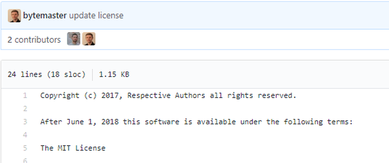
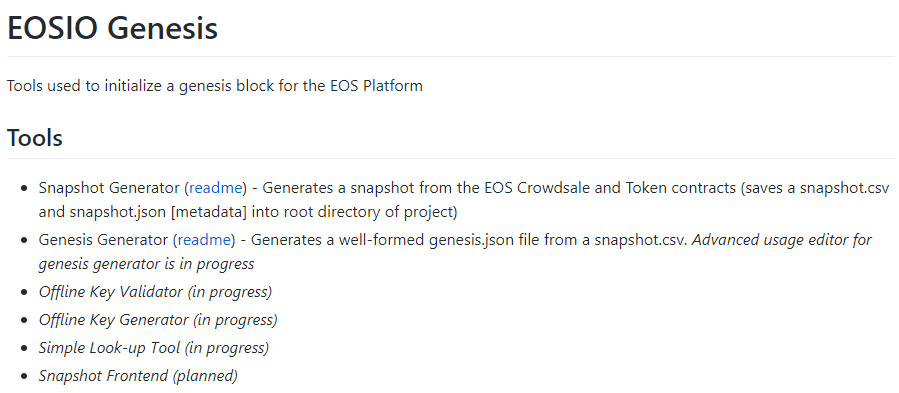

## How your EOS Tokens move from Ethereum to the EOS blockchain
## 如何将你EOS代币从以太坊链切换到EOS区块链上

------------------------------------------------------

> 本文翻译自：https://medium.com/@eosforumorg/how-your-eos-tokens-move-from-ethereum-to-the-eos-blockchain-dafd8448a375
>
> 译者：[区块链中文字幕组](https://github.com/BlockchainTranslator/EOS) [林炜鑫](https://github.com/weixin1993)
> 
> 翻译时间：2017-11-12

---------------------------
A lot of people got confused by the EOS token crowdsale. It’s especially parts like this that make people scratch the back of their heads…

许多人对EOS代币的众筹感到困惑。尤其是这个让人们挠头的部分…

*EOS TOKENS HAVE NO RIGHTS, USES OR ATTRIBUTES.* The EOS Tokens do not have any rights, uses, purpose, attributes, functionalities or features, express or implied, including, without limitation, any uses, purpose, attributes, functionalities or features on the EOS Platform. Company does not guarantee and is not representing in any way to Buyer that the EOS Tokens have any rights, uses, purpose, attributes, functionalities or features.

*EOS代币没有任何权限、用途或者属性*。EOS代币没有任何权限、用途、目的、属性、功能或特性，显性或者隐形，即使在EOS平台上也没有任何用途、目的、属性、功能或特性。公司不能保证，也不会以任何方式向买方表示，EOS代币具有任何权利、用途、用途、属性、功能或特性。

Feel free to read the whole license agreement on the EOS website if you want to learn more. And just to be clear: This blogpost is not an investment advice but only a way to express my personal views on the EOS Tokens.

如果你想了解更多，可以在EOS网站上阅读完整的许可协议。需要说明的是:这个博客文章不是投资建议，只是一种表达我对EOS代币的个人观点的方式。

### Why?
### 为什么？

EOS.IO has made it very clear that they won’t launch a public blockchain. They only make the software and leave it up to block producers (BPs) to start a network using the EOS software. Currently these BPs can not start a public network as the software license doesn’t allow that without clear permission.

EOS.IO已经明确表示，他们不会推出一个公共区块链。他们只生产软件，并将其保留，以让区块链生产商(BPs)使用EOS软件启动一个网络。目前，这些区块（BPs）链生产商不能启动一个公共网络，因为软件许可证不允许没有明确的许可。

So the questions is; why? Why did BLOCK.ONE choose this road over starting their own chain? Well, it looks like this all comes down to legal issues.

所以问题是:为什么?为什么BLOCK.ONE选择这条路来开始他们的区块链?看起来，这一切都归结到法律问题上。

The Securities and Exchange Commission is taking an interest in the hottest craze in cryptocurrency, the initial coin offering (ICO), and apparently the SEC is not into the hype.

美国证券交易委员会正对加密数字货币以及初次数字货币募集（ICO）的狂热感兴趣，但显然美国证券交易委员会并不热衷于炒币。

This is probably also the reason why you can’t join the EOS Tokensale from the US. It looks like BLOCK.ONE saw this coming. So by stating that the token has no purpose and that BLOCK.ONE doesn’t guarantee anything they actually cover their asses in a legal way so to speak.

这可能也是你不能加入以美国公民参加EOS代币销售的原因。它看起来好像BLOCK.ONE意识到这会到来。因此，通过声明这个代币没有任何目的，并且BLOCK.ONE不能保证他们用合法的方式来保障投资者。

### Technical Purpose

### 技术目的

To cover my own legal ass here as well here I will talk about the technical part of the token. Can you do anything with it?? Well, the answer is yes. There’s a nice repo on the EOS GitHub which shows the way you can move your tokens from Ethereum to EOS. It is called GENESIS and will probably be part of the genesis block of a public EOS blocchain.

为了在这里保障自己，我将讨论一下代币的技术部分。你能做点什么吗??答案是肯定的。在EOS GitHub上有一个不错的回购协议，它展示了你可以将你的代币从以太坊移动到EOS的方式。它被称为“创世纪”，很可能是“公共EOS区块链”的起源。

So moving your tokens from Ethereum to EOS probably comes down to using your private Ethereum key to claim the tokens on the EOS system. As your token balance is on EOS from the genesis block you can use them from the first seconds that EOS is “live”. And do they have any technical function?? Yes, you need some to create an account and you can stake them for storage or to help a certain dApp. EOS has a maximum inflation rate of 5% per year which means that 5% new tokens will be mined every year. So in the first year, when EOS has 1 billion tokens in circulation this might add up to 50 million tokens. Or almost 1 million new EOS tokens per week for the block producers. And as dApp-developers stake tokens to get resources they also vote for BPs which brings us great competition.

因此，将您的代币从以太坊移到EOS可能会使用您的私有以太坊键来声明EOS系统上的代币。由于你的代币余额来自于创世纪块中的EOS，你可以在EOS“启动”的第一个秒中使用它们。他们有什么技术功能吗?？是的，你需要创建一个账户，然后可以把它们储存起来，或者帮助某个dApp。EOS每年的最高通胀率为5%，这意味着每年将有5%的新币被开采。所以在第一年，当EOS有10亿代币的流通时，这可能会增加5000万个代币。或者是每星期大约有100万个新的EOS代币。而且，当dApp开发者们用代币来获取资源时，他们也会投票给BPs，这给我们带来了巨大的竞争。

### Forks and Airdrops

### 分叉和空投

As BLOCK.ONE makes it very easy to create a genesis block using the Ethereum ICO-contract I expect several entities to start a public EOS blockchain. We’ll probably see things like “EOS Classic” or “EOS Dark” right from the start as many different groups have many different visions on how EOS should work. I don’t know if there’s anyway BLOCK.ONE can or will prevent this but owners of EOS tokens on Ethereum might have several “airdrop tokens” on different implementations of the EOS software right after the software becomes available on June 1, 2018. There will probably be just 1 “real” public chain which has 80% or more support from users. Just like there’s only 1 real Bitcoin blockchain at the moment.

正因为BLOCK.ONE通过以太坊ICO契约来生成创世纪区块链变得非常容易，我希望有许多实体可以创建一个公开的EOS区块链。我们可能会从一开始就看到类似“EOS经典”或“EOS黑暗”这样的东西，因为许多不同的团队对EOS的工作方式有很多不同的看法。
我不知道BLOCK.ONE是否能够或者将会组织这些情况的发生，但在以太坊的EOS代币所有者可能会在该软件于2018年6月1日上市后，在EOS软件上不同实现许多“空投代币”。可能只有一个“真正的”公共链，它有80%或更多的用户支持。就像目前只有一个真正的比特币区块链。

[Join the EOS Community Forum.](https://eosforum.org/)

[欢迎加入EOS社区论坛](https://eosforum.org/)

----------------------------------------------------

#### 区块链中文字幕组

致力于前沿区块链知识和信息的传播，为中国融入全球区块链世界贡献一份力量。

如果您懂一些技术、懂一些英文，欢迎加入我们，加微信号:w1791520555。

[点击查看项目GITHUB，及更多的译文...](https://github.com/BlockchainTranslator/EOS)

#### 本文译者简介

林炜鑫，在读硕士，专注区块链技术研究与行业分析，欢迎加微信号:happyzai1993。

本文由币乎社区（bihu.com）内容支持计划赞助。

版权所有，转载需完整注明以上内容。

----------------------------------------------------
