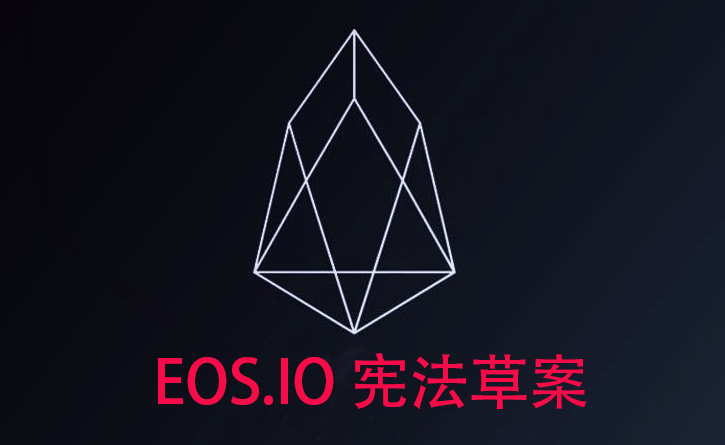

> 本文翻译自：https://forums.eosgo.io/discussion/719/article-viii-v0-3-0-draft-eos-io-constitution-block-producer-agreement
>
> 作者：Thomas Cox , block.one 产品副总裁
>
> 译者：[区块链中文字幕组](https://github.com/BlockchainTranslator) [鱼](https://github.com/oscnet)
>
> 翻译时间：2018-4-26

Article VIII - v0.3.0 Draft EOS.IO Constitution - Block Producer Agreement

# 第八条 -  v0.3.0 EOS.IO章程草案 - 节点（即区块生产者）协议

Purpose

## 目的
This article authorizes a governance document, the Block Producer Agreement. It's intended to be a take-it-or-leave-it offer by the Members acting collectively and setting out what those Members want each Block Producer to do (and refrain from doing).

本文对称为“节点协议”的治理文件进行了授权。它的目的是成为一个由成员共同运作提出的要么接受要么离开的提议，并且陈述了这些成员想要节点做什么（或不能做什么）

Text of Article

## 条款

No Member shall serve as a Block Producer who has not agreed in advance to the Block Producer Agreement provided by the Members of this blockchain.

任何成员在没有事先同意由本区块链成员规定的“节点协议”前均不得成为节点。

Discussion

## 讨论
The Constitution is intended to be as brief as possible, and the Block Producer Agreement is potentially detailed. For that reason it was decided to separate that Agreement into its own document.

“宪法”旨在尽可能简短，“节点协议”可能是详细的。出于这个原因，决定将该协议分开成为它自己的文件。

If the Constitution did not contain this Article, then the BP Agreement would be at best a nice-to-have rather than a must-have aspect of Governance.

如果“宪法”不包含这一条款，那么“区块生产者协议”协议充其量不过是一份美好的协议，而不是一个必须具备的治理方向。

It seems likely that Block Producers, seeking to signal their trustworthiness and attract votes, may agree to the Block Producer Agreement and also undertake additional promises. There's nothing wrong with BPs seeking to embrace a higher standard than whatever may be found in the Block Producer Agreement.

节点为寻求信任和吸引选票，可能会同意节点协议并承担其它的额外承诺. 节点寻求接受一个比"节点协议"更高的标准，这并没有什么问题。

The method of agreeing is not specified. It's likely that the Ricardian Contract for the "RegProducer" system command, by which a Member registers themselves as a BP candidate, will include the BP Agreement by reference. If so, then the act of registering as a BP candidate will entail agreeing to the BP Agreement. If true, one might think this Article superfluous. But that is not so -- this Article raises the BP Agreement's status from a mere Contract to a Governing document co-equal to the Constitution itself. This gives the BP Agreement greater standing in cases of Arbitration; specifically, the BP Agreement like the Constitution overrule any Contract, should they be in conflict.

协商方法没有规定。 成员通过使用李嘉图合约的“RegProducer”系统命令注册成为节点候选人，其中李嘉图合约将会包括节点协议。如果是这样，那么注册成为节点候选人的行为将需要同意节点协议。如果属实，可能会认为这个条款是多余的。但事实并非如此 --该条款将节点协议的地位从单纯的合同提升为与宪法本身同等高度的管理文件。这使节点协议在仲裁中具有更高的地位，具体而言，节点协议如同宪法一样，如果与其它合约存在冲突，将以它为准，并驳回其它合约。

References

## 参考

A link to the latest Block Producer Agreement should go here once it is published.

一旦发布，最新的节点协议的链接将放在这里。

[EOS 纽约行为准则参考](https://steemit.com/eos/@eosnewyork/eos-new-york-code-of-conduct)

Change History

更改历史

26-Apr-2018: added link to EOS New York Code of Conduct in the References section.

* 2018-4-26 在参考部分加入 EOS 纽约行为准则

----------------------------------------------------

#### 区块链中文字幕组

致力于前沿区块链知识和信息的传播，为中国融入全球区块链世界贡献一份力量。

如果您懂一些技术、懂一些英文，欢迎加入我们，加微信号:w1791520555。

[点击查看项目GITHUB，及更多的译文...](https://github.com/BlockchainTranslator/EOS)

#### 本文译者简介

鱼 区块链技术爱好者，欢迎加微信号交流：**oscnet**

版权声明：

版权所有，经 Thomas Cox 授权译者在 [区块链中文字幕组 (github.com/BlockchainTranslator)](https://github.com/BlockchainTranslator/)  和 [币乎（bihu.com）](http://www.bihu.com)
上发表。不得转载。

----------------------------------------------------
