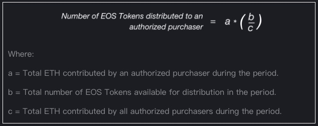

# Frequently Asked Questions | 常见问题

> 本文翻译自：https://eosio.github.io/eos/group__eosc.html
>
> 译者：[区块链中文字幕组 胡亮](https://github.com/gumoon)
>
> 翻译时间：2017-10-29

Here are some common questions about EOSTM and EOS.IOTM

这里有一些关于 EOS 和 EOS.IO 的常见问题

### 1. What is EOS.IO software? | EOS.IO 软件是什么？
EOS.IO is software that introduces a blockchain architecture designed to enable vertical and horizontal scaling of decentralized applications (the “EOS.IO Software”). This is achieved through an operating system-like construct upon which applications can be built. The software provides accounts, authentication, databases, asynchronous communication and the scheduling of applications across multiple CPU cores and/or clusters. The resulting technology is a blockchain architecture that has the potential to scale to millions of transactions per second, eliminates user fees and allows for quick and easy deployment of decentralized applications. For more information, please read the [EOS.IO Technical White Paper](https://github.com/EOSIO/Documentation/blob/master/TechnicalWhitePaper.md).

EOS.IO（也叫：EOS.IO 软件）是一个软件，它引入一种区块链架构，使得去中心化应用程序支持垂直和水平扩展。这是通过类似于构建应用程序的操作系统实现的。该软件提供账户、身份验证、数据库、异步通信以及跨多 CPU 核心和集群的应用程序调度。由此产生的技术是一个区块链架构，它有潜力扩展到每秒百万级交易量，消除用户费用，以及允许快速且容易的开发去中心化应用程序。更多信息，请阅读 [EOS.IO 技术白皮书](https://github.com/EOSIO/Documentation/blob/master/TechnicalWhitePaper.md)

### 2. Who is building the EOS.IO Software? | 谁正在构建 EOS.IO 软件？
block.one, a Cayman Islands exempted company, is building the EOS.IO Software. With employees and advisors based around the world, the company focuses on business-grade technology solutions, including blockchain software development. For more information about block.one, please visit [block.one](http://www.block.one/).

block.one，一个开曼群岛豁免公司，正在构建 EOS.IO 软件。与雇员和世界各地的顾问一起，公司专注于企业级的技术解决方案，包括区块链软件开发。有关更多关于 block.one 的信息，请访问 [block.one](http://www.block.one/)。

### 3. Will the EOS.IO Software be released under open source software license? | EOS.IO 软件会基于开源软件协议发行吗？
Yes, at the end of its development stage, block.one will be releasing the EOS.IO Software it has developed under an open source software license.

是的。开发的最后阶段，block.one 公司将会基于开源软件协议发行已开发完的 EOS.IO 软件。

### 4. What are EOS tokens? | EOS 代币是什么？
EOS tokens are ERC-20 compatible tokens distributed on the Ethereum blockchain pursuant to a related ERC-20 smart contract (the “EOS Tokens”).

EOS 代币是 ERC-20 兼容代币，它依据相关 ERC-20 智能合约（"EOS 代币“），在以太坊区块链上分配的。

### 5. What features, uses or attributes do EOS Tokens have? Can the EOS Tokens be used on a blockchain adopting the EOS.IO Software? | EOS 代币有哪些特性、属性？它能在采用 EOS.IO 软件的区块链上使用吗？
block.one is building the EOS.IO Software but it will not configure and/or launch any public blockchain platform adopting the open source EOS.IO Software (the “EOS Platform”). Any launch of an EOS Platform will occur by members of the community unrelated to block.one. Third parties launching the EOS Platform may delete, modify or supplement the EOS.IO Software prior to, during or after launching the EOS Platform.

block.one 正在构建 EOS.IO 软件但是它不会配置或推出任何公开的采取 EOS.IO 软件的区块链平台。任何跟 block.one 公司不相关的社区成员都可以推出 EOS 平台。第三方推出的 EOS 平台可以在推出之前，期间或之后删除、修改或者补充 EOS.IO 软件。

The EOS Tokens do not have any rights, uses, purpose, attributes, functionalities or features, express or implied, including, without limitation, any uses, purpose, attributes, functionalities or features on the EOS Platform.

EOS 代币没有任何权利、用途、目的、属性、功能或特性，明示或者暗示，包括但不限于在 EOS 平台上的任何用途、目的、属性、功能或特性。

### 6. What does EOS stand for? EOS 代表着什么？
We believe that EOS means different things to different people. We have received numerous amazing interpretations of what EOS stands for or what it should stand for so we have decided not to formally define it ourselves.

我们相信 EOS 对不同的人有不同的意义。关于 EOS 代表什么或者 EOS 应该代表什么，我们收到了许多令人惊叹的解释。因此，我们决定不正式的定义它。

### 7. How does the EOS Token distribution work? EOS 代币怎么分配？
The EOS Token distribution will take place over 341 days starting on June 26, 2017 at 13:00 UTC. One billion (1,000,000,000) EOS Tokens will be distributed according to the schedule below:

EOS 代币销售将从 2017年6月26日，标准时区 13:00开始，持续 341 天。将根据以下计划销售 10 亿 EOS 代币：

1. 200,000,000 EOS Tokens (20% of the total amount of EOS Tokens to be distributed) will be distributed during a 5 day period beginning on June 26, 2017 at 13:00 UTC and ending on July 1, 2017 at 12:59:59 UTC (the “First Period”).

    2亿 EOS 代币（销售总量的20%）将在最开始的5天销售完。即：从2017年6月26日标准时区13:00开始至2017年7月1日标准时区12:59:59。称为：第一阶段。

2. 700,000,000 EOS Tokens (70% of the total amount of EOS Tokens to be distributed) will then be split evenly into 350 consecutive 23 hour periods of 2,000,000 EOS tokens each beginning on July 1, 2017 at 13:00:00 UTC.

    7亿 EOS 代币（销售总量的70%）将被平分为 350 个连续的 23 小时周期内。从 2017年7月1日标准时区13:00开始，每个周期销售 200 万个 EOS 代币。

3. 100,000,000 EOS (10% of the total amount of EOS Tokens to be distributed) will be reserved for block.one and cannot be traded or transferred on the Ethereum network.

    1亿 EOS代币（销售总量的10%）将为 block.one 保留，并且不能在以太坊网络交易和转移。

At the end of the 5 day period and at the end of each 23 hour period referred to above, the respective set number of EOS Tokens set forth above will be distributed pro rata amongst all authorized purchasers, based on the total ether (“ETH”) contributed during those periods, respectively, as follows:

上文提到的5天之后和23小时之后，以上规定的各自集合的 EOS 代币数量将根据在相应周期内以太坊的出资数，分别按比例分配给所有经授权的购买者。公式如下：

Where:

a = Total ETH contributed by an authorized purchaser during the period.

a = 周期内一个经授权的购买者的以太坊出资数

b = Total number of EOS Tokens available for distribution in the period.

b = 周期内 EOS 代币的可分配总数

c = Total ETH contributed by all authorized purchasers during the period.

c = 周期内所有经授权的购买者的以太坊出资总数

As an example: 

举个例子：

20 EOS Tokens are available during a period.

周期内可分配 EOS 代币总数

Bob contributes 4 ETH and Alice contributes 1 ETH during the period. The period ends.

周期内，Bob 出资 4 个 ETH，Alice 出资 1 个 ETH。然后，周期结束。

As a total of 5 ETH were contributed for 20 EOS Tokens during the period, 1 EOS Token will be distributed for every 0.25 ETH contributed. Therefore, Bob receives 16 EOS Tokens and Alice receives 4 EOS Tokens.

由于周期内20个 EOS 代币募集了 5 个 ETH，所以，每 0.25 个 ETH 分配 1 个EOS。因此，Bob 收到 16 个 EOS 代币，Alice 收到 4 个 EOS 代币。

### 8. Why was this token distribution method chosen? | 为什么选择这个代币分配方案？
A lot of token distributions only allow a small amount of people to participate. The EOS Token distribution structure was created to provide a sufficient period of time for people to participate if they so choose, as well as give people the opportunity to see the development of the EOS.IO Software prior to making a decision to purchase EOS Tokens.

大部分的代币销售方案仅仅允许少部分的人参与。EOS 销售方案提供给想参与的人充足的时间周期。同时，给人们一个机会：在决定购买 EOS 代币之前，先看看 EOS.IO 软件的开发情况。

### 9. Was there any EOS Token pre-sale or ways to obtain EOS Tokens prior to the commencement of the EOS Token distribution? | EOS 代币有预售吗？或者有没有在 EOS 代币公开分配开始之前获得代币的方式？
No.

没有。

### 10. Why is the number of EOS Tokens available for distribution higher in the First Period? | 为什么第一阶段分配的 EOS 代币那么多？
The number of EOS Tokens available during the First Period of the EOS Token distribution (i.e. the first 5 days) is higher than in subsequent periods in order to: (1) accommodate the current interest and demand that we have received for the EOS Tokens; and (2) help to more accurately determine early stage price discovery of the EOS Tokens.

第一阶段（最开始的5天）分配的 EOS 代币数比之后的周期多，有以下原因：（1）为了适应当前的兴趣和我们收到的对 EOS 代币的强烈需求；（2）帮助更加准确地确定 EOS 代币早期的价格水平。

### 11. Why are founders EOS Tokens being reserved for block.one? | 为什么 block.one 公司保留创始人 EOS 代币？
Founders tokens were allocated to block.one pursuant to feedback we received from the community in order to ensure that block.one has aligned interests with those participating in the EOS Token distribution. The founders tokens represent 10% of the aggregate EOS Token distribution (or 100,000,000 EOS Tokens) (the “Founders Tokens”). The EOS Token distribution smart contract does not permit block.one to trade or transfer the Founders Tokens during the EOS Token distribution period.

创始人代币分配给 block.one 公司，是因为我们收到了来自社区的反馈，说，为了确保 block.one 公司和参与 EOS 代币众筹者有一致的利益。创始人代币相当于总发行量的 10%。EOS 代币分配智能合约不允许 block.one 在 EOS 代币发行期间内交易和转移创始人代币。

If an EOS Platform adopting the EOS.IO Software is launched, the default EOS.IO Software configuration developed by block.one will lock new founders tokens distributed pursuant to such EOS Platform in a smart contract and release 10,000,000 (10%) of such tokens to block.one at the end of each one year anniversary of the genesis block over a period of 10 years. As mentioned above, the EOS.IO Software configuration of the EOS Platform will be ultimately determined by the community when someone other than block.one initializes a genesis block and starts a blockchain.

如果一个采用 EOS.IO 软件的 EOS 平台运行起来，根据智能合约，EOS.IO 软件默认配置将在那个 EOS 平台上锁定新的创始人代币，释放 1亿（即10%）那个代币给 block.one。每年1%，长达10年。如上所述，EOS 平台的 EOS.IO 软件配置将由社区最终确定，某个人，而不是 block.one ，初始化一个创始区块，并且启动一个区块链。

### 12. How can I participate in the EOS Token distribution? | 我怎么购买 EOS 代币？
To participate in the EOS Token distribution, you will need an Ethereum compatible wallet or an application where you and only you hold the private keys. Private keys are needed to correctly interact with smart contract functions, like transferring cryptographic tokens. Do not send ether (“ETH”) directly from cryptocurrency exchanges, only an ETH compatible wallet.

为了购买 EOS 代币，你需要一个以太坊兼容钱包或者一个只有你持有私钥的应用程序。使用智能合约功能，像转账，需要私钥。不要从数字货币交易所直接发送以太坊，只能从以太坊兼容钱包发送。

For detailed information and suggestions on how to purchase EOS Tokens, [click here](https://eos.io/#token-sale)

关于怎么购买 EOS 代币的详细信息和建议，[点击这里](https://eos.io/#token-sale)

### 13. What ETH compatible wallets are recommended? | 推荐使用哪个 ETH 兼容钱包？
We recommend using either:

* MetaMask (Chrome browser addon); or
* MyEtherWallet (no download needed).

我们推荐以下两个之一：

* MetaMask (chrome浏览器插件）；或者
* MyEtherWallet(不需要下载）。

The following wallets are known to be incompatible wallets; this is not a complete list. Do not use any of the following wallets to participate in the EOS Token distribution:

以下是已知的不兼容钱包；这不是一个完整的列表。不要使用以下任一钱包参与 EOS 代币的销售。

* Any Bitcoin exchange
* Any Ethereum exchange
* Jaxx
* Exodus
* Coinbase
* Poloniex
* Kraken
* Bitstamp
* Bitfinex
* Bittrex
* Cex.io

### 14. Is there a minimum purchase for EOS Tokens? | EOS 代币有最小购买量吗？
The minimum contribution accepted during any period of the EOS Token distribution is 0.01 ETH. Smaller contribution amounts will be rejected.

在 EOS 代币销售期间内，最小的出资额是 0.01 个 ETH。更小的出资额将被拒绝。

Additionally, to minimize bloat of any genesis block configuration, any ETH wallet that holds less than 1 EOS Token or another minimum amount could be ignored by the person who configures and launches the EOS Platform based on the EOS.IO Software. This, however, will ultimately be decided by the person who configures and launches the EOS Platform.

另外，为了最小化创始区块配置，在基于 EOS.IO 软件的 EOS 平台上，任何持有少于1个 EOS 代币或者其他最小数额代币的 ETH 钱包可能被忽略。这样的话，最终将由配置并运行 EOS 平台的人决定。

### 15. How can I see how much ETH has been contributed during a specific period of the EOS Token distribution? | 在一个特定的 EOS 代币销售周期内，怎么查看已经募集到的 ETH 数？
The amount of ETH received during each current period will be displayed on the eos.io website. The history of ETH contributed in previous periods can be viewed on the Ethereum blockchain.

当前周期内募集到的 ETH 数，将在 eos.io 网站上显示。之前各周期内募集的 ETH 数可以在以太坊区块链上查看。

### 16. Is it possible to limit the amount of ETH paid per EOS Token? | 可以限制每个 EOS 代币对应支付的 ETH 数量吗？
No, it is not possible to know the price of a specific period until all ETH is received for that period and if you contribute in the last minutes or seconds of a specific period, there is no way to guarantee that your ETH will be received for that period. Please review all the risks associated with purchasing EOS Tokens including the technical risks set forth in the Purchase Agreement.

不可以。在周期内所有的以太坊全部接收之前，不可能知道一个特定周期的价格。如果你在一个特定周期的最后一分钟或最后几秒钟出资，没有办法确保你的以太坊可以在那个周期内被接收。请检查涉及购买 EOS 代币的所有风险点，包括在购买协议中阐明的技术风险点。

### 17. Why can’t U.S. citizens, residents or entities purchase EOS Tokens? | 为什么美国公民、居民和实体不能购买 EOS 代币？
It was decided that U.S. citizens, residents and entities should be excluded from purchasing EOS Tokens in the token distribution because of some of the logistical challenges associated with differing regulations in the many states of the United States of America. block.one does not believe that the distribution of EOS Tokens or the EOS Tokens themselves are securities, commodities, swaps on either securities or commodities, or similar financial instruments. The EOS Tokens are not designed for investment or speculative purposes and should not be considered as a type of investment. Nevertheless, U.S. citizens, residents and entities should not purchase or attempt to purchase EOS Tokens.

决定将美国公民、居民和实体排除在代币分发中，原因是美国许多州不同的制度带来的后勤挑战。block.one 公司不认为销售 EOS 代币或 EOS 代币本身是有价证券，商品，任何证券或商品的互换，或类似的金融工具。EOS 代币不是为了投资或投机目的而设计的，不应被视为投资的一种类型。尽管如此，美国公民、居民和实体不应购买或试图购买 EOS 代币。

### 18. I have contributed to the EOS Token distribution. When do I receive EOS Tokens? | 我已经出资购买了 EOS 代币。什么时候，我会收到 EOS 代币？
At the end of each period, you may claim any EOS Tokens allocated as an ERC-20 compatible token on the Ethereum blockchain. For more details on how to claim your EOS Tokens, please see eos.io.

每个周期的结束，你可以在以太坊区块链上认领 EOS 代币。关于怎么认领你的 EOS 代币的更多详请，请查看 eos.io 网站。

### 19. Are EOS Tokens transferable? | EOS 代币可以交易吗？
While block.one will not be involved in any way in the transferability of the EOS Tokens, it is possible that EOS Tokens could be transferred on a peer-to-peer basis or on platforms operated by 3rd parties during the EOS Token distribution period. EOS Tokens will become fixed (non-transferable) on the Ethereum blockchain within 23 hours after the end of the final EOS Token distribution period which will occur on June 1, 2018 at 22:59:59 UTC.

EOS 代币销售期间，虽然 block.one 公司不会以任何方式卷入 EOS 代币交易。但是，EOS 代币支持 P2P 方式转移，或者在第三方平台交易。在 EOS 代币销售期结束（2018年6月1日标准时区22:59:59）之后的23个小时内，以太坊区块链上，EOS 代币将暂停交易。

### 20. Are there network fees when transferring EOS Tokens? | 交易 EOS 代币有网络服务费吗？
Yes, the EOS Token is an ERC-20 compatible token; therefore, transfers will be subject to ETH gas fees like all other transactions on the Ethereum network.

是的。EOS 代币是一个 ERC-20 兼容的代币，因此，交易受限于 ETH gas 手续费，像以太坊网络上的所有其它交易一样。

### 21. When will I receive native cryptographic tokens on the EOS Platform? | 我什么时候可以收到 EOS 平台的原生加密代币？
As mentioned above, EOS Tokens will become fixed (non-transferable) on the Ethereum blockchain within 23 hours after the end of the final EOS Token distribution period which will occur on June 1, 2018 at 22:59:59 UTC. At this point the EOS Token distribution process will be complete and any person who wishes to launch an EOS Platform adopting the EOS.IO Software will be able to generate a JSON file mapping EOS public keys to the fixed balances of the EOS Tokens from the state of the Ethereum blockchain.

正如上面所提到的，EOS 代币将在最后一个分发周期结束后的 23 个小时内被固定(不可转移)，这将发生在2018年6月1日的22:59:59 UTC。在这时，EOS 代币分发流程将完成，任何希望基于 EOS.IO 软件，推出 EOS 平台的用户都可以生成一个 JSON 文件，将 EOS 公共密钥映射到以太坊区块的EOS 代币的固定余额。

The EOS.IO Software is built such that any EOS Platform that adopts the EOS.IO Software will require approval of holders of not less than 15% of the total issued and outstanding EOS Tokens before tokens on such blockchain (the “Blockchain Tokens”) can be transferred. In other words, if the EOS.IO Software is adopted, it will be the responsibility of holders holding at least 15% of the issued and outstanding EOS Tokens to adopt one or more blockchains in order for Blockchain Tokens received on such blockchains to be transferrable.

基于 EOS.IO 软件推出的 EOS 平台，要求获得超过15%的发行和未发行的 EOS 代币持有者的批准，才能让平台代币（区块链代币）交易。换句话说，如果是 EOS.IO 软件被采用，它将由持有至少15%的发行和未发行的 EOS 代币的持有者承担责任，去采用一个或多个区块链，以让在这个区块链上获得的区块链令牌可转移。

As block.one will not configure and/or launch any EOS Platform, block.one will have no control over when, how or whether the EOS.IO Software is adopted or implemented, or how, when or whether the EOS Platform is launched. As such, you should not expect and there is no guarantee that you will receive any other cryptographic tokens or digital assets now or in the future.

由于 block.one 公司不会配置或运行任何 EOS 平台， block.one 将没法控制什么时候、以怎么样的方式或者是否 EOS.IO 软件被采用或实现，以及，已怎么样的方式、什么时候或是否 EOS.IO 软件被运行。正因为此，你不应该期待，而且不保证将会收到任何其他加密代币或数字资产，现在或未来。

### 22. What happens if I can’t contribute ETH or don’t receive my EOS Tokens? | 如果我不能参加募集或者没有收到 EOS 代币，是什么原因呢？
The EOS Token distribution contract, EOS Token smart contract and the EOS Tokens are being provided on an “as is” and “as available” basis without representations, warranties, promises or guarantees whatsoever of any kind made by block.one. Prior to purchasing EOS Tokens, you should ensure that you carry out your own examination and investigation and carefully review in their entirety the risks associated with purchasing EOS Tokens as set forth in the Purchase Agreement. Purchases of EOS Tokens are non-refundable and purchases cannot be cancelled. Under no circumstances will you be entitled to receive money or compensation for any EOS Tokens purchased or your inability to purchase EOS Tokens.

EOS 代币销售合约，EOS 代币智能合约和 EOS 代币在 ”as is" 和 “可用” 基础上提供，没有任何形式的声明、保证、承诺或保证。在购买 EOS 代币之前，您应该确保您自己进行调查，并仔细地检查购买协议中关于购买的EOS 代币所涉及的全部风险。购买 EOS 代币是不可退还的，并且不能取消购买。在任何情况下，您都无权获得任何购买的 EOS 代币或无法购买 EOS 代币的金钱或补偿。

### 23. Where do the proceeds from the EOS Token distribution go? EOS 代币销售的收入去哪了？
Proceeds from the EOS Token distribution will be the revenue of block.one.

EOS 代币销售的收入将是 block.one 公司的收入。

### 24. What does block.one plan to use proceeds from the EOS Token distribution for? | block.one 公司计划使用代币销售的收入做什么？
As a private company, proceeds of the EOS Token distribution will be utilized by block.one in its sole discretion. block.one intends to use certain of the proceeds for general administration and operating expenses, as well as to build a blockchain consulting business focusing on helping businesses re-imagine or build their businesses on the blockchain, developing more open source software that may be helpful to the community and building decentralized applications using EOS.IO Software.

作为一家私营企业，EOS 代币的销售收入将被 block.one 公司独立、谨慎的使用。block.one 公司将把部分 EOS 代币销售收入用于日常管理和公司运营开支，以及建立一个专注于帮助企业基于区块链再现或者建立他们的业务的区块链咨询业务，开发更多对社区有用的开源软件，使用 EOS.IO 构建去中心化应用程序。

### 25. Why are proceeds from the EOS Token distribution not being donated to a foundation or other non-profit organization? | 为什么 EOS 代币销售收入不捐赠给基金会或者其它非营利性组织？
Blockchains that adopt the EOS.IO Software do not require a foundation or a non-profit organization to help grow or maintain the network because such blockchains will be self-funding. Based on the EOS.IO Software, it is intended that any blockchain that adopts the EOS.IO Software will generate natural inflation in such blockchain tokens at a rate of five percent per year to be distributed to the platform’s block producers in connection with their confirmation of transactions on the platform and to the top three smart contracts or proposals that receive the most amount of votes from holders of such tokens. In this case, such a blockchain will not be reliant on any one foundation, organization, or individual for its growth, development or maintenance.

采用 EOS.IO 软件的区块链不需要基金会或非营利组织来帮助发展或维护网络，因为这样的区块链将是自筹资金。EOS.IO 软件的目标是任何采用 EOS.IO 软件的区块链将产生自然通货膨胀，区块链代币量以每年百分之五的速度增长，并分配给平台的块生产者和三大智能合约或收到代币持有者最多投票的提议。在这种情况下，这样的区块链不会依赖于任何一个基金会、组织或个人的成长、发展或维护。

### 26. Will block.one be contributing to the EOS Token distribution? | block.one 会参与出资参与 EOS 代币销售吗？
No, during the entire EOS Token distribution period, block.one will not do any of the following:
* block.one will not purchase EOS Tokens by any means;
* block.one will not pay any dividends to its shareholders; and
* block.one will not perform any share buybacks.

不会。在整个 EOS 代币销售期间，block.one 将不会做以下任一一件事情：
* block.one 不会以任何理由购买 EOS 代币。
* block.one 不会给股东支付任何股息；并且
* block.one 不会执行任何回购。

block.one intends to engage an independent third party auditor who will release an independent audit report providing further assurances that block.one has not purchased EOS Tokens during the EOS Token distribution period or traded EOS Tokens (including using proceeds from the EOS Token distribution for these purposes). This report will be made available to the public on the [eos.io](https://eos.io/) website.

block.one 公司打算聘请独立的第三方审计机构，他们将发布一份独立审计报告，提供进一步的担保: 在EOS令牌分发期间，我们还没有购买 EOS 代币，也没有交易 EOS 代币(包括使用 EOS 代币发行的收入来实现这些目的)。这份报告将在 [eos.io](https://eos.io/) 网站上向公众公布。

----------------------------------------------------

#### 区块链中文字幕组

致力于前沿区块链知识和信息的传播，为中国融入全球区块链世界贡献一份力量。

如果您懂一些技术、懂一些英文，欢迎加入我们，加微信号:w1791520555。

[点击查看项目GITHUB，及更多的译文...](https://github.com/BlockchainTranslator/EOS)

#### 本文译者简介

胡亮 区块链技术爱好者，欢迎加微信号:haobaba-huliang

本文由币乎社区（bihu.com）内容支持计划赞助。

版权所有，转载需完整注明以上内容。

----------------------------------------------------

