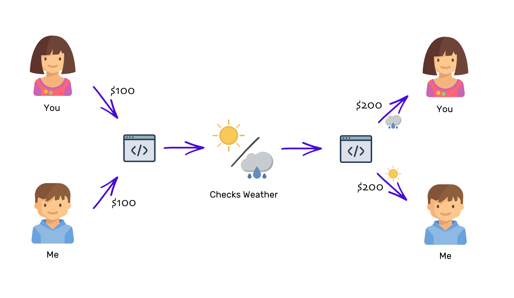

# The new age of DApps is here, and it’s not based on Ethereum 
DApps 的新时代将至, 但不是基于以太坊的

***What are the other options besides Ethereum that the developers have?***
***除了以太坊，开发人员还有哪些选择？***

> 本文翻译自：https://hackernoon.com/the-new-age-of-dapps-is-here-and-its-not-based-on-ethereum-2246fc4d9eee
> 
> 译者：[区块链中文字幕组](https://github.com/BlockchainTranslator/EOS) [小丹](https://github.com/zhuangjun)
> 
> 翻译时间：2017-10-29

**ICOs are said to be the new way to raise money.** We’ve seen companies raising $100 million, $156 million, $185 million and even $232 million by selling tokens that will be used in the protocol that these companies have promised to build using this money.

**ICOs 被认为是新的筹款方式.** 我们已经看到，通过出售那些将在协议中使用的代币，有公司筹集了1亿美元, 1亿5600万美元, 1亿8500万美元, 甚至2亿3200万美元。 这些公司承诺用这些钱来开发。

Against the money raised, the tokens they gave were created and sold on the Ethereum blockchain — meaning that all the trade that took place happened on the Ethereum blockchain and the tokens created are tracked on the Ethereum blockchain. But that is changing.

依靠筹集的这些钱, 他们在以太坊的区块链上创建和出售代币 - 这意味着所有的交易都发生在以太坊的链上，也在以太坊上被追踪。
但这正在改变。

>By the way, I am editor of a weekly newsletter, Unmade, which delivers one startup idea to your inboxes every week.

> 顺便提一下, 我是每周时刊的编辑 Unmade, 我每周都会有一个关于创业的想法送到你的收件箱。

### Smart contracts

### 智能合约

> “A verbal contract isn’t worth the paper it’s written on.” — Samuel Goldwyn

> "口头合约不值得它写在纸上"-Samuel Goldwyn

**Ethereum’s mission of making blockchain more than a calculator** has allowed them to popularize the concept of smart contracts. You can think of smart contracts as a set of rules governing something, which cannot be modified ever in the future. They allow a developer to write anything in the form of a smart contract that gets executed by the network. Consider the example:

**以太坊的使命是使区块链不仅仅一个计算器**， 它推广了智能合约的概念。您可以将智能合约看作是一套管理某种东西的,并且永远不可修改的规则。它允许开发人员编写任何可在它网络中执行的智能合约。请考虑以下示例:

If A and B place a bet about the next day’s weather, the bet can be carried out in a trustless manner using a smart contract. Both of them can submit their betting amounts to the smart contract. At a predefined time on the next day, the contract will make an API call to the Open Weather API to see if the weather is sunny or rainy. Depending on the weather, the total amount will be sent to either of the two.

如果 A 和 B 对第二天的天气进行押注, 则可以使用智能合约以互不信任的方式进行下注。他们都可以将自己的投注金额提交到智能合约。在第二天的预定时间, 合约将调用查询天气的公开接口, 以查看天气是晴天还是雨天。根据天气情况, 总金额将被发送到两者之一。

Because this contract is no more than a software program and gets executed on a stranger’s computer, it had to be made sure that the programmer cannot exploit the stranger’s computer or the whole network. To fix the problem, Ethereum came up with its native programming language — Solidity. Although the language is Turing-complete, which means any program can be written in it, there’s still a steep learning curve — and the developer community is in its infancy.

因为这个合约只是一个软件程序, 在一个陌生人的计算机上被执行, 所以必须确保开发者不能浸入陌生人的计算机或整个网络。为了解决这个问题, 以太坊出了它原生编程语言--Solidity。尽管语言是图灵完整的, 这意味着任何程序都可以在其中编写, 但仍然有一个陡峭的学习曲线-开发者社区处于起步阶段。

These two limitations have made Ethereum be perceived as merely an ICO platform, rather than a world computer.

这两个限制使以太坊仅被认为是一个 ICO 平台, 而不是一个世界计算机。

Besides these Ethereum-specific disadvantages, it also faces the problems of the blockchain in general — slow speed and no native identity on the blockchain. But blockchains are evolving — we are living in the first few years when the internet was invented. It’s slow, expensive, clunky; but hey, it’s the future!

除了这些缺点外, 以太坊还面临着区块链的普遍问题--速度慢和没有本地标识。但是区块链正在进化--我们就像生活在互联网刚被创造的前几年。 目前区块链是缓慢的, 昂贵的, 笨拙的; 但是, 嘿, 这是未来!

### Is the future anywhere near?

### 未来将至？

> “You cannot escape the responsibility of tomorrow by evading it today.” — Abraham Lincoln

> "今天你不能逃避明天的责任"-亚伯拉罕·林肯

**As a huge advocate of blockchain in general,** I am quite excited by the research and development happening in the space. With recent developments, we are seeing new blockchains coming up in the industry that offer so much more: They make developers move to using these newer blockchains for building their decentralized apps and ICOs.

**作为区块链的强烈倡导者,** 我对这个领域的研究和发展感到很兴奋。随着最近的发展, 我们可以看到有新的公链出现， 并且它们允许: 让开发者基于它们开发去中心化应用和 ICO。

I am particularly excited by development in the blockchains that allow general computations to happen in a decentralized manner. The newer generation of such blockchains offers much more than the ability to write smart contracts.

我特别兴奋的是,随着区块链的发展, 一般计算也能以去中心化的方式参与进来。新一代的区块链提供了比智能合约更多的功能。

### Support for programming language

### 编程语言的支持

> “A programming language is low level when its programs require attention to the irrelevant.” — Alan Perlis

>> "编程语言是低水平的, 如果它的程序员需要关注无关的东西."-Alan Perlis

**When it comes to writing a smart contract,** the biggest obstacle that I hear from the Ethereum developer community is the requirement to learn a new programming language. I agree that the syntax looks very similar to JavaScript, but it still is a different language and requires you to think of a problem with a different mindset.

**在编写智能合约时**, 我从以太坊开发者社区听到的最大的障碍是需要学习一种新的编程语言。我同意, 它的语法看起来非常类似于 JavaScript, 但它仍然是一种不同的语言, 并要求不同的思维方式。

Tezos blockchain decided to go with a functional programming language for the smart contracts. Most developers are alien to functional programming and might find the learning curve steeper than Ethereum’s Solidity.

Tezos 决定使用函数式编程语言来开发智能合约。大多数开发人员对函数式编程都是陌生的, 可能会发现学习曲线比以太坊的稳健性更陡。

Another blockchain, NEO, promises to offer support for .Net and Java to begin with, and eventually will allow programs written in Python and Go on its platform. With these four languages supported by NEO, it will already serve about 90 percent of the developer community from the get-go.

另一个公链, NEO, 一开始就承诺提供对.Net 和 Java 的支持, 并最终将允许 Python 和 Go 在它的平台上开发。有了这四种语言支持的 NEO, 已经能服务 90% 的开发者社区了。

Qtum is another blockchain that allows developers to write Ethereum-like smart contracts, but using Bitcoin’s UTXO format. In bitcoin, there’s no concept of an account and balance. Instead of tracking every account’s balance, the unspent transactions are tracked (the transactions that were sent to your wallet and are not spent yet). The sum of those transactions make up your balance. It is very efficient and lightweight to maintain these records as compared to accounts on an Ethereum-based model. Qtum thus allows for very lightweight smart contracts.

Qtum（量子）是另一个公链, 它允许开发者写编写类似以太坊的智能合约, 但使用比特币的 UTXO 格式。在比特币中, 没有帐户和余额的概念。它不跟踪每个帐户的余额, 而是跟踪未使用的交易记录 (发送到您的钱包并没有花费的交易记录)。这些交易的总和构成了你的余额。与以太坊的帐户相比, 维护这些记录是非常高效和轻量级的。Qtum 因此允许非常轻量级的智能合约。

It’s interesting to see how different blockchains are adopting various programming paradigms for their blockchains. Some are targeted toward consumers and some toward large enterprises.

有趣的是, 我们可以看到不同的区块链是如何采用各种不同的编程范式的。有的针对消费者, 有的面向大企业。

### Native blockchain identity

### 区块链本地标识

> “Everyone thinks that a new place or a new identity will jumpstart a new life.” — Caroline Leavitt

> "每个人都认为新的地方或新的身份会开启新的生活"-Caroline Leavitt

**On the Ethereum blockchain,** your identity is the public key whose private key you own. Every smart contract you deploy gets its own public address (identity).

**在以太坊上** 您的标识是您的私钥对应的公钥。您部署的每个智能合约都有自己的公钥 (标识)。

Unlike the pseudonymous model of Ethereum, blockchains like NEO offer users a native identity that can be used across the apps on the blockchain. Imagine if the internet had allowed every user to have a native identity, then you’d have never been required to create a separate one for every service you use on the internet.

不同于以太坊的匿名模式，NEO 提供可以跨它链上应用程序的ID。试想一下, 如果互联网允许每个用户都有一个本地ID, 那么你不需要为互联网上的每个服务再创建一个了。

Some say blockchain is the new internet. There are several mental models in which to fit blockchain, and I, too, believe considering it as the new internet is not a bad analogy. A native identity on the blockchain will have a native identity that can be used to access anything that gets built on the blockchain.

有人说区块链是新的互联网, 我也相信把它认为新的互联网不是一个坏的比喻。区块链的本地标识可以被构建在上面的任何东西所使用。

There are several teams working to solve the identity problem on blockchains. For instance, on Ethereum, Civic allows a user to record his/her identity that he/she can later use for other apps on the blockchain.

有几个团队致力于解决区块链上的身份问题。例如, 在以太坊上, Civic 允许用户记录他/她的身份, 稍后可以适用于以太坊上的其他应用。

I find blockchain-level native identity a worthy proposition because if there’s no native identity, the teams that are solving the identity problem will make the ecosystem fragmented.

我发现区块链级别的本地身份是一个值得一提的命题, 因为如果没有本地身份, 解决身份问题的团队将使生态系统支离破碎。

### Consensus protocol

### 共识协议

> “A genuine leader is not a searcher for consensus but a molder of consensus.” — Martin Luther King, Jr.

"真正的领导者不是寻求共识者, 而是达成共识的人."-马丁. 路德. 金, Jr。

**The current generation of blockchains** gets criticized for how much energy it consumes to power the network. The costs are high because of the consensus method Bitcoin or Ethereum blockchain uses.

**这一代的区块链** 被批评网络消耗的能量太多。费用高是由于比特币和以太坊采用的共识方法造成的。

In any blockchain, periodically all the nodes in the network will have to agree to the updated state of the system. Because the nodes are geographically distributed and are not always keeping track of every other node in the network, they would be required to sync themselves and agree upon the new state of the network.

在任何区块链中, 网络中的所有节点都必须定期同意系统的更新状态。由于节点在地理上是分布式的, 并且并不总是和其他节点同步, 因此它们需要同步自己并同意网络的新状态。

Currently, the most popular consensus method is proof of work, where every node tries to claim the updated state of the network by solving a cryptographic puzzle. Whoever solves it first gets to tell the network what the updated state is. Everyone agrees to it and proceeds ahead.

目前, 最流行的共识方法是工作量证明, 每个节点试图通过解决一个密码难题来宣称网络的更新状态。首先解决它的人会告诉网络更新状态是什么。每个人都同意它, 并继续前进。

The disadvantages of this method are that it is slow and expensive. There are several solutions to this problem, with their own pros and cons. While Ethereum is on its way to move consensus to proof of stake, Qtum and Tezos launched with a version of a proof of stake consensus protocol from the start. Interesting is that Tezos and Qtum go a step ahead and offers a decentralized way of governance to adopt any major upgrades to the protocol. Every major upgrade is proposed and voted upon, making the hard forks theoretically rare.

这种方法的缺点是速度慢且成本高。这个问题有几个解决方案, 各有优缺点。虽然以太坊正准备将共识转移到POS, 有趣的是,Qtum 和 Tezos 一开始就是基于POS的。 Tezos 和 Qtum 还向前迈进了一步, 提供了一种去中心化的治理方式, 以通过对协议的任何重大升级。每一个主要的升级都会被提议和投票, 使硬分叉理论上不可能出现。

On the other hand, NEO uses a delegated Byzantine Fault Tolerance (dBFT) consensus mechanism that makes it possible to sync up the network a lot quicker without spending a lot of energy. It supports up to 10,000 transactions per second as compared to Ethereum’s 15 transactions per second.

另一方面, NEO 使用了一个授权拜占庭式容错 (dBFT) 共识机制, 使得在不耗费大量精力的情况下, 同步网络的速度会更快一些。与以太坊的每秒15次交易相比, 它每秒支持多达1万次交易

### Blockchain is the future — but how does the future look?

### 区块链是未来 -  但未来是怎么样的呢？

> Google wasn’t the first search engine, and Facebook wasn’t the first social network — they were the best ones.

> 谷歌不是第一个搜索引擎, Facebook 不是第一个社交网络, 他们是最好的。

**We might see a similar trend** when it comes to the blockchain world. Bitcoin and Ethereum have shown us something that we considered impossible before. But they are far from being perfect.

**类似的趋势**存在于区块链的世界。比特币和以太坊已经向我们展示了一些我们认为不可能的东西。但它们远非完美。

While blockchain is the future, I do not believe the future is what we are living today. We are living among the experiments. What we see around us might be in ruins tomorrow. What we get as our future might not have been invented yet.

虽然区块链是未来, 但我不相信未来就是现在的样子。我们还生活在实验之中。我们现在周围可以见的明天可能已经消失。我们的未来可能还没有被发明出来。

With hopes still high and a sharp eye on the industry, I am waiting for the ultimate blockchain. Will it be Ethereum? Or NEO? Or Qtum? Or Tezos? Or something else? I don’t know. For now, I am excited to witness one of the largest shifts a human life can live through. Even if the future does not appear to be near, the future is not far either.

怀着对行业的希望和敏锐的眼光, 我还在等待终极的区块链。会是以太坊吗？还是 NEO？还是 Qtum？还是 Tezos？还是别的什么？我不知道。现在, 我很兴奋地目睹了人类生活所能经历的最大变化之一。即使未来似乎不近, 未来也不远。

----------------------------------------------------

#### 区块链中文字幕组

致力于前沿区块链知识和信息的传播，为中国融入全球区块链世界贡献一份力量。

如果您懂一些技术、懂一些英文，欢迎加入我们，加微信号:w1791520555。

[点击查看项目GITHUB，及更多的译文...](https://github.com/BlockchainTranslator/EOS)

#### 本文译者简介

小丹 区块链技术爱好者  热衷于区块链底层技术研究 ， 欢迎加微信号 zhuangjun0606

本文由币乎社区（bihu.com）内容支持计划赞助。

版权所有，转载需完整注明以上内容。

----------------------------------------------------